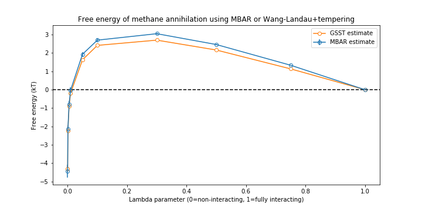

# generalized_tempering
Generalized serial simulated tempering

Enhanced sampling for a flexible range of specific or non-specific collective variables / reaction coordinates / configurational parameters.

# na_cl_pmf
In this dir, find two calculations of the PMF vs. separation distance for a sodium and chloride ion pair in explicit solvent. 

- The PMF is first generated using the (multistate) Bennet Acceptance Ratio with the PyMBAR library. This is a typical workflow for calculating free energy across a reaction coordinate, and serves as an anchor point against which we can measure the accuracy of the generalized tempering weights.
- A second PMF is estimated using generalized serial simulated tempering + the Wang-Landau algorithm. Observe that the weights closely track the free energy as estimated by MBAR:

_Note the zero point is arbitrary, since free energies are compared using relative differences, not absolute values. Here the zero point is set to the arithmetic mean._ 

# chemical_potential a.k.a. alchemical annihilation

In this dir, find a similar comparison as above. This time, instead of separation distance, we temper 'lambda', which in this context refers to a value that ranges [0,1] and scales the nonbonded interactions of some particle or molecule. See the readme in that directory for some more details. There is some noise in the middle (unclear which is inaccurate, or if the true value is in the middle) but the end-points agree nicely:

# alanine_dipeptide_dihedral

So generalized tempering can find the same free energy as MBAR. But MBAR comes with error bars, and actually takes less simulation time. So why not just use MBAR? The real point of tempering is to temper some process that will enhance sampling across a related coordinate. In this dir, find a simulation of alanine dipeptide with tempered dihedrals. The free energy across the states isn't interesting here, and the weights are only used to maintain detailed balance. 
You can see how the slow degree of freedom is sped up by tempering the dihedral angles. 

