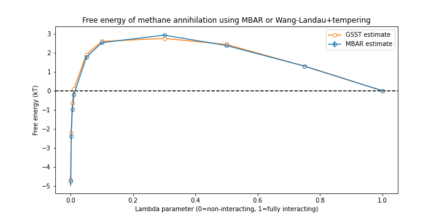

# generalized_tempering
generalized serial simulated tempering (GSST) - enhanced sampling for a flexible range of configurational or potential-energy reaction coordinates.

# intro
The OpenMM [SimulatedTempering](http://docs.openmm.org/latest/api-python/generated/simtk.openmm.app.simulatedtempering.SimulatedTempering.html) script allows you to add temperature tempering to an OpenMM simulation. It combines a couple of nice approaches:
- Wang-Landau algorithm ([doi](https://doi.org/10.1103/PhysRevLett.86.2050)) to estimate the weights - equivalent to free energies - between the chosen temperatures
- 'Metropolized independence sampling' ([doi](https://doi.org/10.1063/1.3660669)) that increases the efficiency of exploration across the temperature range

The concept of tempering isn't restricted to temperature. For example, the solute-solvent interactions can be scaled ([doi](https://doi.org/10.1021/ct900274n)), which is basically a serial version of REST (replica exchange with solute tempering). As described in the context of 'generalized REST' ([doi](https://doi.org/10.1063/1.5016222)), this extends to tempering any part of the potential energy function, be it nonbonded, bonded, or some combination of the two. In addition, configurational parameters can be tempered, akin to serial umbrella sampling in a single replica.

This repo uses an adapted SimulatedTempering script to implement generalized, serial, simulated tempering (see notebooks below for examples). Configurational and PE-tempering are used, and calculated free energies are compared to the same estimate using the MBAR method ([doi](https://doi.org/10.1063/1.2978177)). The script uses a `scalingFactor` parameter, alternatively called lambda in the literature, to record the tempered state.

The advantage over 1D umbrella sampling is for people with only a single GPU - it's convenient to set-and-forget a GSST run instead of dealing with multiple repeats followed by WHAM. Conversely, the disadvantage is that MBAR gets reasonable free energy estimates with probably less total sampling, plus it also gives error bars. ¯\\\_(ツ)_/¯ YMMV. 

# na_cl_pmf
In this dir, find two calculations of the PMF vs. separation distance for a sodium and chloride ion pair in explicit solvent, calculated by either PyMBAR or GSST. 

The GSST weights track the free energy as estimated by MBAR. Decreasing the GSST cutoff will increase the accuracy of the weights estimates, at the cost of more sampling. 

# fe_of_hydration

In this dir, find a similar comparison as above. This time, instead of separation distance, nonbonded interactions between a solute molecule and the surroundings are tempered. To keep things simple and fast, the particle is just a 'united atom methane' i.e. a single fat carbon atom with no charge, just lennard-jones parameters. 

Again, free energies match up:

# alanine_dipeptide_dihedral

not done yet!

