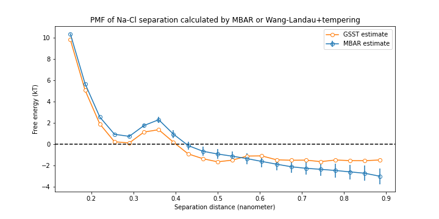

# generalized_tempering
Generalized serial simulated tempering

Enhanced sampling for a flexible range of non-specific collective variables / reaction coordinates / configurational parameters.

# na_cl_pmf
In this dir, find two calculations of the PMF vs. separation distance for a sodium and chloride ion pair in explicit solvent. 

- The PMF is first generated using the (metropolized) Bennet Acceptance Ratio with the PyMBAR library. This is a typical workflow for calculating free energy across a reaction coordinate, and serves as a demonstration that generalized tempering is finding the correct free energy.
- A second PMF is estimated using generalized serial simulated tempering + the Wang-Landau algorithm. Observe that the weights learned closely track the free energy as estimated by MBAR:

\tCaption comment

# chemical_potential a.k.a. alchemical annihilation

In this dir, find a similar comparison as above. This time, instead of separation distance, we temper 'lambda', which in this context refers to a value that ranges [0,1] and scales the nonbonded interactions of some particle or molecule. At lambda=1, everything interacts as normal. At lambda=0, the particle is fully 'switched-off', i.e. is in a completely non-interacting state with the the rest of the particles, and the weights learned inbetween these states again corresponds to the free energy. The difference in weights between lambda=0 and lambda=1 thus corresponds to the chemical potential, the free energy of which is here obtained using MBAR. 

